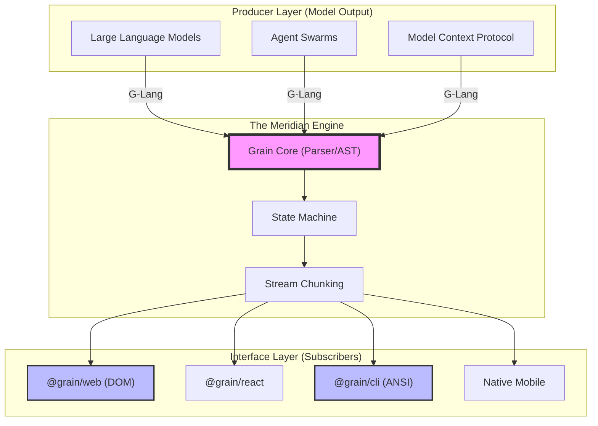

# Grain

[](https://www.npmjs.com/package/grain)
[](https://github.com/sir-ad/grain/actions)
[](https://github.com/sir-ad/grain/blob/main/LICENSE)

**The Universal Interaction Layer for AI Interfaces.**

The standard vocabulary for every surface where AI meets humans — or AI meets AI.

---

### The Problem

Every AI tool rebuilds the same wheel: chat UI, streaming text, tool calls, artifact rendering, and human-in-the-loop approvals. Every AI model outputs different JSON formats. Every agent framework uses proprietary message envelopes.

### The Solution

**Grain** makes it standard. If AI models output G-Lang — and every platform knows how to render G-Lang — the interface problem disappears. 

It is the **HTML for AI.**

### Features

- **Pico Sized:** ~15KB core. Zero dependencies.
- **Universal Primitives:** 15+ atomic types including `<stream>`, `<tool>`, `<artifact>`, `<approve>`, `<think>`, `<form>`, `<chart>`, `<table>`, `<layout>`, and `<memory>`.
- **Platform Agnostic:** The exact same G-Lang syntax renders perfectly on Web, CLI, MCP (Model Context Protocol), and between Autonomous Agents.
- **Agent-to-Agent Protocol:** Standardized handoffs and state persistence between multi-agent swarms using Grain Context chunks.
- **Developer First:** Built for ease of use. Grab what you need and own your code.

---

### Quick Start (Web & React)

Create a fully configured Grain application instantly:

```bash
npx create-grain-app@latest my-ai-app
```

Or, add specific primitives inline (shadcn/ui style) so you maintain full control over the code:

```bash
npx grain add stream
npx grain add tool-call
```

### Quick Install (CLI & Core)

To use the Grain Core parser or Terminal adapters globally:

**npm:**
```bash
npm install -g grain
```

**Homebrew (macOS/Linux):**
```bash
brew install sir-ad/tap/grain
```

**cURL / bash:**
```bash
curl -fsSL https://sir-ad.github.io/grain/install.sh | sh
```

### Philosophy

Semantic markup. No arbitrary classes. Drop in. Works. Standards, not frameworks.

```grain
<message role="assistant">
  <think model="chain-of-thought" visible="false">
    User asks about weather. Call weather tool.
  </think>
  <stream speed="fast">Checking weather for you...</stream>
  <tool name="get_weather" args='{"city": "Mumbai"}' status="running" />
</message>
```

### Architecture: The Meridian Protocol

Grain operates on the **Meridian Layer**, a standardized interaction plane between diverse AI models and heterogenous interfaces.



### Packages Architecture

| Package | Purpose |
|---|---|
| `grain` | Core parser, chunk-streaming engine, state machines |
| `@grain/react` | Official React hooks & wrappers |
| `@grain/web` | Native Custom HTML Web Components |
| `@grain/cli` | Terminal adapter & ANSI rendering |
| `@grain/mcp` | Model Context Protocol adapter |
| `@grain/agent` | Agent-to-agent communication envelope |

### Documentation

- [Introduction & Quick Start](QUICK-START.md)
- [The G-Lang Spec](SPEC.md)
- [G-Lang Syntax Reference](G-LANG.md)
- [System Architecture](ARCHITECTURE.md)

---

MIT License. https://github.com/sir-ad/grain
