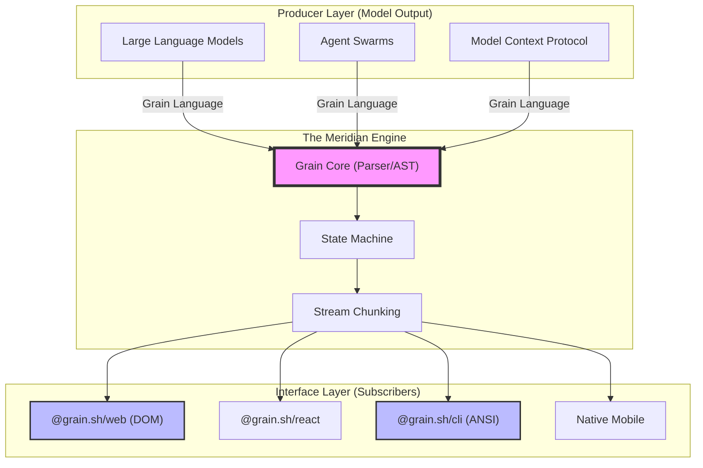
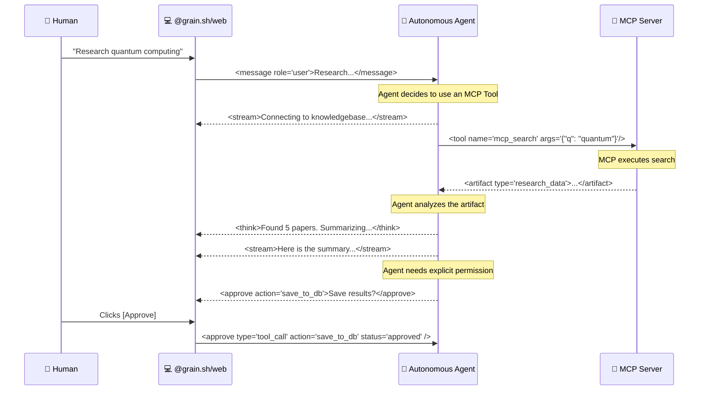

# Grain

[](https://www.npmjs.com/package/@grain.sh/core)
[](https://github.com/sir-ad/grain/actions)
[](https://github.com/sir-ad/grain/blob/main/LICENSE)
[](https://github.com/sir-ad/grain)
[](https://github.com/sir-ad/grain)
[](https://github.com/sir-ad/grain)

**The Universal Interaction Layer for AI Interfaces.**

The standard vocabulary for every surface where AI meets humans — or AI meets AI.

---

### The Problem

Every AI tool rebuilds the same wheel: chat UI, streaming text, tool calls, artifact rendering, and human-in-the-loop approvals. Every AI model outputs different JSON formats. Every agent framework uses proprietary message envelopes.

### The Solution

**Grain** makes it standard. If AI models output Grain Language — and every platform knows how to render Grain Language — the interface problem disappears. 

It is the **HTML for AI.**

### Features

- **Pico Sized:** ~15KB core. Zero dependencies.
- **Universal Primitives:** 15+ atomic types including `<stream>`, `<tool>`, `<artifact>`, `<approve>`, `<think>`, `<form>`, `<chart>`, `<table>`, `<layout>`, and `<memory>`.
- **Platform Agnostic:** The exact same Grain Language syntax renders perfectly on Web, CLI, MCP (Model Context Protocol), and between Autonomous Agents.
- **Agent-to-Agent Protocol:** Standardized handoffs and state persistence between multi-agent swarms using Grain Context chunks.
- **Developer First:** Built for ease of use. Grab what you need and own your code.

---

*Unified documentation site is now available at https://sir-ad.github.io/grain/ (under the `/grain/` base path).*

### Quick Start (Web & React)

Create a fully configured Grain application instantly:

```bash
npx create-grain-app@latest my-ai-app
```

### Quick Install (CLI & Core)

Use the core parser locally and install the distributables that expose runtime binaries:

```bash
npm install @grain.sh/core @grain.sh/web
npm install -g @grain.sh/cli
npm install -g grain-mcp
```

Or use the bootstrap script:
```bash
curl -fsSL https://cdn.jsdelivr.net/gh/sir-ad/grain@main/install.sh | sh
```

### Philosophy

Semantic markup. No arbitrary classes. Drop in. Works. Standards, not frameworks.

```grain
<message role="assistant">
  <think model="chain-of-thought" visible="false">
    User asks about weather. Call weather tool.
  </think>
  <stream speed="fast">Checking weather for you...</stream>
  <tool name="get_weather" args='{"city": "Mumbai"}' status="running" />
</message>
```

### Architecture: The Meridian Protocol

Grain operates on the **Meridian Layer**, a standardized interaction plane between diverse AI models and heterogenous interfaces.



### What is Grain? The Full AI & Agent Ecosystem

Grain is not just a markup language; it is the **universal interaction layer** for the modern AI stack.

```mermaid
graph TD
    classDef human fill:#e1f5fe,stroke:#03a9f4,stroke-width:2px,color:#000
    classDef agent fill:#f3e5f5,stroke:#9c27b0,stroke-width:2px,color:#000
    classDef tool fill:#e8f5e9,stroke:#4caf50,stroke-width:2px,color:#000
    classDef grain fill:#fff3e0,stroke:#ff9800,stroke-width:4px,color:#000

    User(("👤 Human User")):::human
    
    subgraph "Application Interface (Frontend)"
        ChatUI["React / Web UI (#64;grain.sh/web)"]:::human
        CLI["Terminal CLI (#64;grain.sh/cli)"]:::human
    end

    subgraph "The Grain Interaction Layer"
        GrainDoc{{"📝 Grain Context Document"}}:::grain
    end

    subgraph "Autonomous Ecosystem"
        ChiefAgent["🧠 Chief Orchestrator Agent"]:::agent
        Researcher["🔍 Research Sub-Agent"]:::agent
        Coder["💻 Coder Sub-Agent"]:::agent
        
        Tool1["🔧 Web Search Tool"]:::tool
        Tool2["📂 File System Tool"]:::tool
    end

    User <-->|Types/Clicks| ChatUI
    User <-->|Commands| CLI
    
    ChatUI <-->|Renders & Submits <form>, <approve>| GrainDoc
    CLI <-->|Renders & Submits| GrainDoc
    
    GrainDoc <-->|Parses & Appends <message>, <think>| ChiefAgent
    
    ChiefAgent <-->|Delegates via <agent> tags| Researcher
    ChiefAgent <-->|Delegates via <agent> tags| Coder
    
    Researcher <-->|Executes <tool> tags| Tool1
    Coder <-->|Executes <tool> tags| Tool2

    Tool1 -.->|Returns <artifact>| GrainDoc
    Tool2 -.->|Returns <artifact>| GrainDoc
```



### The MCP & Agent Interaction Layer

How does Grain connect Model Context Protocol (MCP) servers and Autonomous Agents seamlessly in runtime?



### Packages Architecture

| Package | Purpose |
|---|---|
| `@grain.sh/core` | Core parser, chunk-streaming engine, state machines |
| `@grain.sh/react` | Official React hooks & wrappers |
| `@grain.sh/web` | Native Custom HTML Web Components |
| `@grain.sh/cli` | Terminal adapter with the `grain` executable |
| `@grain.sh/mcp` | Model Context Protocol adapter |
| `grain-mcp` | Stdio MCP server for Grain tooling |
| `@grain.sh/agent` | Agent-to-agent communication envelope |

### Documentation

- [Introduction & Quick Start](QUICK-START.md)
- [The Grain Language Spec](SPEC.md)
- [Grain Language Syntax Reference](GRAIN-LANGUAGE.md)
- [System Architecture](ARCHITECTURE.md)

---

MIT License. https://github.com/sir-ad/grain
